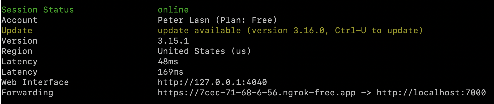
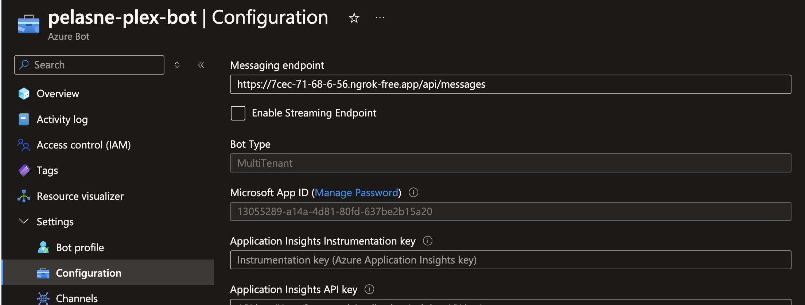
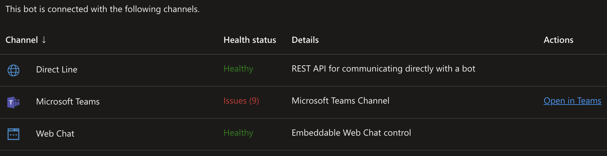

# Chat Bot

This project is just a simple chat bot that gets messages streamed from an LLM component.

## Azure Bot Service

Deploy an Azure Bot Service and make note of the CLIENT_ID and CLIENT_SECRET for use below.

## Config

Create a "local.env" file in the root of the project (or create Environment Variables some other way) with at least the following content:

```bash
MicrosoftAppType=MultiTenant
MicrosoftAppId=???
MicrosoftAppPassword=???
```

The settings available are:

__ENV_FILES__ [STRING, OPTIONAL]: A comma-delimited list of files to load. The files are loaded in order, so later files take precedence. The default is "local.env".

- __PORT__ [INTEGER, DEFAULT: 3978]: The port the bot will listen on.

- __OPEN_TELEMETRY_CONNECTION_STRING__ [STRING, REQUIRED]: The connection string for Open Telemetry. This is used to send telemetry data to Azure Monitor.

- __MicrosoftAppType__ [ONE-OF: MultiTenant, SingleTenent, ManagedIdentity, REQUIRED]: The type of the Microsoft App. ManagedIdentity has not be tested.

- __MicrosoftAppId__ [GUID, REQUIRED]: The App ID of the Microsoft App. This is the ID of the App Registration in Azure AD. This is also known as the CLIENT_ID.

- __MicrosoftAppPassword__ [STRING, REQUIRED]: The password of the Microsoft App. This is the password of the App Registration in Azure AD. This is also known as the CLIENT_SECRET.

- __MicrosoftAppTenantId__ [GUID, *]: The Entra Directory ID (Tenant) of the Microsoft App. This is required if SingleTenant is used.

- __MEMORY_URI__ [STRING, DEFAULT: http://localhost:7010]: The URI of the memory service.

- __INFERENCE_URI__ [STRING, DEFAULT: http://localhost:7020]: The URI of the inference service.

- __CHARACTERS_PER_UPDATE__ [INTEGER, DEFAULT: 200]: The number of characters to send to the inference service at a time.

- __FINAL_STATUS__ [STRING, DEFAULT: "Generated."]: The status of a message that is the final message in a conversation.

- __MAX_RETRY_ATTEMPTS__ [INTEGER, DEFAULT: 3]: The maximum number of times to retry a request.

- __SECONDS_BETWEEN_RETRIES__ [INTEGER, DEFAULT: 2]: The number of seconds to wait between retries.

- __MAX_TIMEOUT_IN_SECONDS__ [INTEGER, DEFAULT: 60]: The maximum number of seconds to wait for a response.

- __MAX_PAYLOAD_SIZE__ [INTEGER, DEFAULT: 36864]: The maximum payload size for the adaptive card. The default size comes from <https://learn.microsoft.com/en-us/microsoftteams/platform/bots/how-to/format-your-bot-messages>, but is less to account for metadata in the bot message.

- __VALID_TENANTS__ [ARRAY OF STRINGS, OPTIONAL]: The list of valid tenants. If this is empty, all tenants are valid.

In addition to those settings, there are some settings that are available as part of the NetBricks integration, including:

- __LOG_LEVEL__ [STRING, DEFAULT: "Information"]: The log level for the application. This can be set to "None", "Trace", "Debug", "Information", "Warning", "Error", or "Critical".

- __DISABLE_COLORS__ [STRING, DEFAULT: false]: If true, colors will be disabled in the logs. This is helpful for many logging systems other than the console.

- __APPCONFIG_URL__ [STRING, OPTIONAL]: The URL for the App Configuration service. This is used to pull settings from Azure App Configuration.

- __CONFIG_KEYS__ [STRING, OPTIONAL]: This is a comma-delimited list of configuration keys to pull for the specific service. All keys matching the pattern will be pulled. A setting that is already set is not replaced (so left-most patterns take precident). For example, the dev environment of the auth service might contain "app:auth:dev:*, app:common:dev:*". If you do not specify any CONFIG_KEYS, no variables will be set from App Configuration.

- __ASPNETCORE_ENVIRONMENT__ [STRING, DEFAULT: "Development"]: This is a common .NET setting. It is used by INCLUDE_CREDENTIAL_TYPES.

- __INCLUDE_CREDENTIAL_TYPES__ [STRING, *]: This is a comma-delimited list of credential types to consider when connecting to App Configuration, Key Vault, or using DefaultAzureCredential. It can include "env", "mi", "token", "vs", "vscode", "azcli", and/or "browser". If __ASPNETCORE_ENVIRONMENT__ is "Development", then the default is "azcli, env"; otherwise, the default is "env, mi". You can find out more about the options [here](https://learn.microsoft.com/en-us/dotnet/api/azure.identity.defaultazurecredential?view=azure-dotnet).

## Running locally

For Teams to be able to talk to the bot, you need to expose the bot to the internet. You can use [ngrok](https://ngrok.com/) for this. Run the following command:

```bash
ngrok http 7000
```

In the Azure Bot configuration in Azure, set the Messaging endpoint to the Forwarding address (appending /api/messages) from ngrok.





Click on "Open in Teams" in the Teams channel in Azure Bot, and you should be able to chat with the bot directly in Teams.



## Building a container

You can build a container by going up a level in the folder structure and running the following:

```bash
docker build -t repo.azurecr.io/memory:2.5.0 -f memory.Dockerfile --platform linux/amd64 .
```

## TODO

- Implement editing (OnMessageUpdateActivityAsync) and deleting (OnMessageDeleteActivityAsync) user messages.
- Develop the user's welcome experience (OnMembersAddedAsync).
- Develop the exception handling (AdapterWithErrorHandler).
- Add a very basic HTTP endpoint (localhost only) for debugging the bot without registering with Bot Service.
- Unit testing/integration testing.
